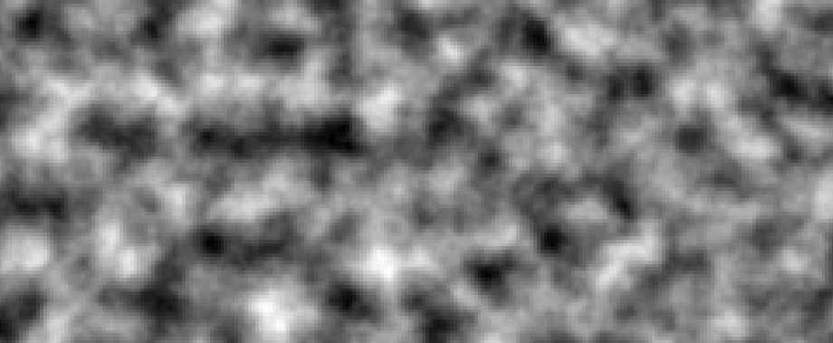
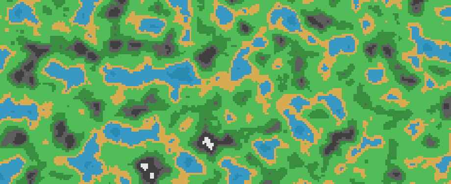

# Tribes Movement Demo

A little project/demo replicating the movement from the Tribes games.

Includes:
- Jetpacking.
- Skiing.
- Propelling yourself by shooting explosive projectiles at the ground behind you.
- Terrain generation.

You just sorta fly and ski around!

## Structure

There are two Unity projects in this tutorial:

1. "LagueTerrainTutorial", which contains work related to following Sebastian Lague's "Procedural Landmass Generation" tutorial series. This is helpful as a precursor to the Tribes project.
2. "TribesMovement" (yet to be added). This will contain the actual project with the demo of the Tribes movement, along with some terrain generation stuff.

## Media

### Terrain Generation

Raw noise:

Colored in:

